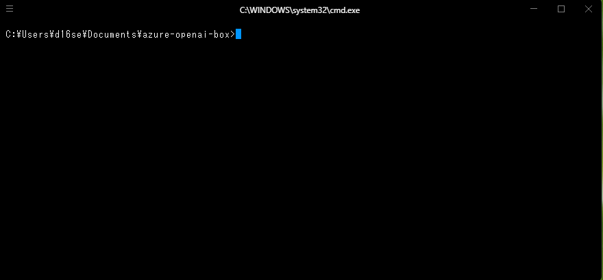

# azure-openai-box

This is a sample code for [Azure Open AI API](https://azure.microsoft.com/en-us/products/cognitive-services/openai-service) written in TypeScript.



## :rocket:Feature
- use Terminal as UI
- support conversation history


## :gear:Requirements

- Node.js v18 or later
- You need to be able to use [Azure Open AI API](https://azure.microsoft.com/en-us/products/cognitive-services/openai-service).

## :computer:Setup

- clone this repository.
```
git clone https://github.com/d16sekine/azure-openai-box.git
```

- install the libraries
```
yarn install
```

- set the environmental variables in `.env`
```
cp .env_example .env
```

### environmental variables
|name|description|
|---|---|
|AZURE_OPENAI_API_URL|Azure OpenAI's API URL|
|AZURE_OPENAI_API_KEY|Azure OpenAI's API key|

## :technologist:Usage

- execute the following command.
```
yarn dev
```

- enter your question into the terminal and the answer will be returned to you.


## :blue_book:Note
- Conversation history will be deleted upon completion of processing.

## :bulb:License
This project is licensed under the terms of the MIT license.